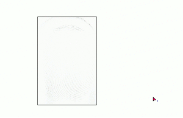

# DevLynx.Futronic



DevLynx.Futronic is a .NET wrapper around the Futronic Fingerprint SDK.

## Getting Started

``` C#
FutronicManager = FutronicManager.Instance;
FutronicManager.DeviceReady += DeviceReady;
FutronicManager.Start();
```

For further simplification, `FutronicProvider` can be used in `WPF` to simplify the capture process.

```C#
/// <summary>
/// Interaction logic for MainWindow.xaml
/// </summary>
public partial class MainWindow : Window
{
    public MainWindow()
    {
        InitializeComponent();

        Loaded += (s, e) => Initialize();
    }

    FutronicProvider FutronicProvider { get; set; }

    void Initialize()
    {
        FutronicProvider = new FutronicProvider();

        FutronicProvider.PropertyChanged += (s, e) =>
        {
            switch (e.PropertyName)
            {
                case nameof(FutronicProvider.Bitmap):
                    _image.Source = FutronicProvider.Bitmap;
                    break;
            }
        };
    }
}
```

More examples are included in the [sample folder](./samples/).